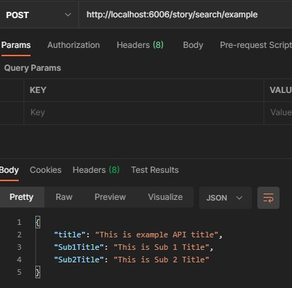

# Storybook 模組開發流程

## 1. 建立 Storybook API

1.  依據 [搜尋結果頁 API](http://lionspec.liontravel.com/LightSpeed.Travel/B2C/search/#id=denfrq&p=5_%E8%B3%87%E6%96%99%E6%A0%BC%E5%BC%8F_json_&g=1) 或 [產品結果頁 API](http://lionspec.liontravel.com/LightSpeed.Travel/B2C/detail/index.html#id=92zo9j&p=5_%E8%B3%87%E6%96%99%E6%A0%BC%E5%BC%8F_json_&g=1) 格式
    ，在 `mockData / story / search` 下建立假資料，名稱同規格書 API 名稱(全小寫)

        (ex : 取得進階搜尋項目 API 取名為 "depthinfojson.json")

        (可以直接借用 u 機現在的 API複製貼上，**後端 API url 需全小寫才能取得**)

&nbsp;

2. 在 `.storybook / middleware.js` 下引入 JSON 檔，並將其以 **POST** 方式輸出成 API

```tsx
// .storybook/middleware.js
const example = require('../mockData/story/search/example.json');

module.exports = (router) => {
    ...
    router.post('/story/search/example', (req, res) => {
        res.send(example);
    })
    ...
}
```

&nbsp;

3. 建立完成後，執行 yarn storybook，在 Postman 或其他 API 開發工具上測試 API 是否建立成功



&nbsp;
&nbsp;

## 2. 撰寫基本 Component 和 MDX 文檔

1. 於 `src / components / SearchPage` 下建立 Component 資料夾 (參照 [搜尋結果頁元件](https://docs.google.com/spreadsheets/d/1S5rGbNnt_FVWZXhw99sSJvx4-bZgRLNp9FfHcwPKApo/edit?usp=sharing) 名稱)，主要檔案為 index.tsx，建立最基本的 Component

```tsx
const Example = () => {
    return <h1>Example</h1>;
};

export default Example;
```

資料夾結構如下

```
Example
    ├── imgs
    │   └── img1.jpg
    │
    ├── subComponents
    │   ├── Sub1.tsx
    │   └── Sub2.tsx
    │
    ├── index.tsx
    └── styles.module.scss
```

&nbsp;

2. 於 `stories / SearchPage` 下建立 Component 資料夾(名稱同上)，主要檔案為 index.stories.mdx，建立最基本的 MDX 檔

    (MDX 檔為 Markdown 和 JSX 的結合，故在此類檔案可以使用 React 語法和 Markdown 語法)

```tsx
import { Meta, Story, Canvas } from '@storybook/addon-docs/blocks';
import Example from '@components/SearchPage/Example';

<Meta title="搜尋結果頁/Example" />

<!--- This is your Story template function, shown here in React -->

# Example

<br />

<Canvas>
    <Story name="一般">
        <Example />
    </Story>
</Canvas>

<br />
```

&nbsp;

3. 執行 yarn storybook 確認是否建立成功

&nbsp;
&nbsp;

## 3. 建立相關 Redux

1. 建立 interface ( 於 `redux / search / interfaces.ts`)

    在 `redux / search /interfaces.ts` 中，依據 [搜尋結果頁 API](http://lionspec.liontravel.com/LightSpeed.Travel/B2C/search/#id=denfrq&p=5_%E8%B3%87%E6%96%99%E6%A0%BC%E5%BC%8F_json_&g=1) 或 [產品結果頁 API](http://lionspec.liontravel.com/LightSpeed.Travel/B2C/detail/index.html#id=92zo9j&p=5_%E8%B3%87%E6%96%99%E6%A0%BC%E5%BC%8F_json_&g=1) 格式建立相關型別

    命名規則為 I_API 名稱 (名稱同規格書大小寫)，舉例如下

```tsx
// search/DepthInfoJson (取得進階搜尋項目)
export interface I_DepthInfo {
    WeekDays?: I_WeekDay[]; // 出發星期
    DayList?: I_Day[]; // 旅遊天數
    PriceRange?: I_PriceRange; // 價格區間
    AirlinesList?: I_AirLine[]; // 航空公司
    TripTypeList?: I_TripType[]; // 標準團名等級
    CategoryList?: I_Category[]; // 標準團名有的旅遊型態
    DepartureList?: I_Departure[]; // 出發地清單
}
```

&nbsp;

2. 建立 actionType，供 `reducer.ts`, `action.ts` 和 `saga / index.ts` 使用 ( 於 `redux / search / actionTypes.ts`)

    命名規則為

    1. SET_API 名稱 (給 saga 使用)
    2. SET_API 名稱\_SUCCESS (saga 成功傳回資料後，傳給 reducer 使用)

    (API 名稱為全大寫)

```tsx
// 範例
export const SET_EXAMPLE = 'SET_EXAMPLE';
export const SET_EXAMPLE_SUCCESS = 'SET_EXAMPLE_SUCCESS';

// search/DepthInfoJson (取得進階搜尋項目)
export const SET_DEPTHINFO = 'SET_DEPTHINFO';
export const SET_DEPTHINFO_SUCCESS = 'SET_DEPTHINFO_SUCCESS';
```

&nbsp;

3. 建立 action ( 於 `redux / search / actions.ts`)

    分別建立給 saga 和 reudcer 用的 action factory，並可以帶入參數

```tsx
export const setExample = (payload: any) => ({
    type: actionTypes.SET_EXAMPLE,
    payload,
});

export const setExampleSUCCESS = (payload: any) => ({
    type: actionTypes.SET_EXAMPLE_SUCCESS,
    payload,
});

export type I_setExample = ReturnType<typeof setExample>;
```

&nbsp;

4. 建立 saga ( 於 `redux / search / saga / index.ts`)

    分別建立 worker(運作者) 和 watcher(監聽者)，命名規則為

    1. Worker：set\${API 名稱}Async
    2. Watcher：watchSet\${API 名稱}Async

    並將 Watcher 執行後 ( Watcher() ) 加入到 `yield all` 的陣列中

```tsx
// Worker
function* setExampleAsync(action: actions.I_setExample): Generator<StrictEffect, any, any> {
    const example = yield call(api.fetchExample, action.payload);
    yield put(actions.setExampleSUCCESS(example));
}

// Watcher
function* watchExampleAsync() {
    yield takeLatest(actionTypes.SET_EXAMPLE, setExampleAsync);
}

export default function* rootSaga() {
    yield all([watchExampleAsync()]);
}
```

&nbsp;

5. 建立 fetch 函式 ( 於 `redux / search / saga / api.ts`)

    - 請使用 axios
    - 請使用 async / await 撰寫非同步
    - 命名規則：fetch\${API 名稱}

```tsx
import fetchAPI from '@utils/fetchAPI';
import DomainByEnv from '@utils/domainByEnv'; // 自動判斷是在本機、u機、正式機，決定不同網域

const pageRoute = `${DomainByEnv()}/page`; // 屬於哪個頁面下的 API

export const fetchExample: I_FetchExample = async (req) => {
    const example = yield call(fetchAPI, {
        url: `${pageRoute}/API_Name`,
        req: action.payload,
    });
    const { data } = await axios.post(url, req);

    return data;
};
```

&nbsp;

6. 加入 reducer ( 於 `redux / search / reducer.ts`)

    請傳回 SET\_\${API 名稱}\_SUCCESS 的 type，並將相對應的屬性以 action.payload 更換

```tsx
const reducer = (state: I_RootState = initialState, action: any) => {
    switch (action.type) {
        ...
        case actionTypes.SET_EXAMPLE_SUCCESS:
            return { ...state, Example: action.payload };
        ...
    }
};
```

&nbsp;
&nbsp;

## 4. Component 和 Redux 串接

1. useDispatch

    在先前 `src / components / searchPage` 中建立的元件引入 `react-redux`

```tsx
import { useDispatch } from 'react-redux';

const Example = () => {
    const dispatch = useDispatch();
    ...
}
```

&nbsp;

並於 `useEffect(() => {}, [])` 中，dispatch 相關的 action，並帶入 API 需要的參數 (可以先設任意值，型別正確即可)

```tsx
useEffect(() => {
    const reqBody = {
        bodyParam1: 'bodyParam1',
        bodyParam2: 'bodyParam2',
    };

    dispatch(setExample(reqBody));
}, []);
```

&nbsp;

2. useSelector

先連接 useSelector，取得 Redux 中的值

並將其 console，確認 有沒有 fetch 到相關 API

```tsx
import { useSelector } from 'react-redux';

function Example () {
    const { Example } = useSelector((state: RootState) => state.search);

    console.log('Example =>', Example);
    ...
}
```

連接到後，就可以嘗試將值渲染出來了

```tsx
function Example () {
    ...
    return (
        <h1>{Example.title}</h1>
    );
}
```

&nbsp;
&nbsp;

## CSS 規範

1. 採用 css-module

    - 將 scss 檔命名為 styles.**module**.scss (要有 **module** 才會編譯成 css-module)
    - class 超過兩個以上使用 classnames
    - 最外層多加一層同模組名稱且小寫的 class (以利頁面拼裝時複寫樣式)
    - 避免巢狀寫法吃到多層 class (已有 css-module 的 hash，可以避免同名稱互相覆蓋)
    - 使用 Stylelint ( 記得安裝 Stylelint Vscode 套件，會擋 commit )

```tsx
import styles from './styles.module.scss';
import cN from 'classnames';

function Example() {
    return (
        <div className={cN('example', styles.example)}>
            <h1 className={styles.title}>{Example.title}</h1>
        </div>
    );
}
```
